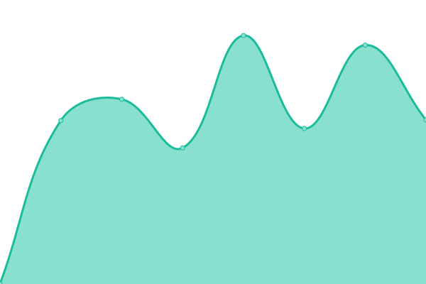

# [📈 Live Status](https://status.qwq2333.top): <!--live status--> **🟩 All systems operational**

This repository contains the open-source uptime monitor and status page for [gao_cai_sheng](qwq2333.top), powered by [Upptime](https://github.com/upptime/upptime).

With [Upptime](https://upptime.js.org), you can get your own unlimited and free uptime monitor and status page, powered entirely by a GitHub repository. We use [Issues](https://github.com/qwq233/upptime/issues) as incident reports, [Actions](https://github.com/qwq233/upptime/actions) as uptime monitors, and [Pages](https://status.qwq2333.top) for the status page.

<!--start: status pages-->
<!-- This summary is generated by Upptime (https://github.com/upptime/upptime) -->
<!-- Do not edit this manually, your changes will be overwritten -->
<!-- prettier-ignore -->
| URL | Status | History | Response Time | Uptime |
| --- | ------ | ------- | ------------- | ------ |
|  [Blog](https://qwq2333.top) | 🟩 Up | [blog.yml](https://github.com/qwq233/upptime/commits/HEAD/history/blog.yml) | 

 2765ms
     
 | 

<a href="https://status.qwq2333.top/history/blog">99.13%</a>
    

|  [Bitwarden](https://pass.qwq2333.top) | 🟩 Up | [bitwarden.yml](https://github.com/qwq233/upptime/commits/HEAD/history/bitwarden.yml) | 

 2195ms
     
 | 

<a href="https://status.qwq2333.top/history/bitwarden">99.43%</a>
    

|  [AuthServer](https://api.qwq2333.top/qa/user/query) | 🟩 Up | [auth-server.yml](https://github.com/qwq233/upptime/commits/HEAD/history/auth-server.yml) | 

 2307ms
     
 | 

<a href="https://status.qwq2333.top/history/auth-server">99.74%</a>
    

|  [NextCloud](https://cloud.qwq2333.top) | 🟩 Up | [next-cloud.yml](https://github.com/qwq233/upptime/commits/HEAD/history/next-cloud.yml) | 

 1593ms
     
 | 

<a href="https://status.qwq2333.top/history/next-cloud">99.67%</a>
    

|  [Jenkins](https://apk.qwq2333.top) | 🟩 Up | [jenkins.yml](https://github.com/qwq233/upptime/commits/HEAD/history/jenkins.yml) | 

 4707ms
     
 | 

<a href="https://status.qwq2333.top/history/jenkins">99.18%</a>
    

<!--end: status pages-->

[**Visit our status website →**](https://status.qwq2333.top)

## 📄 License

- Powered by: [Upptime](https://github.com/upptime/upptime)
- Code: [MIT](./LICENSE) © [gao_cai_sheng](qwq2333.top)
- Data in the `./history` directory: [Open Database License](https://opendatacommons.org/licenses/odbl/1-0/)
